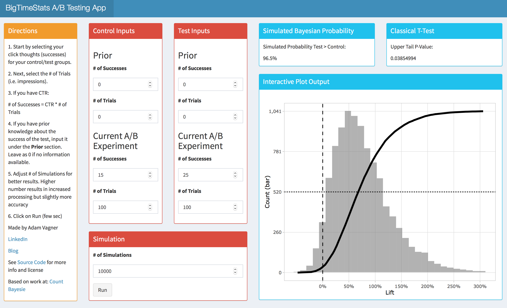

### Bayesian AB Testing

Code repository that visualizes simulated A/B Test Lift distribution and cumulative distribution on the same chart via ggplot2 in R.

Useful to measure click-through rate A/B tests to visualize distribution of possible lift, as well as the probability that the test CTR > control CTR

Additional Info: <a href="https://www.countbayesie.com/blog/2015/4/25/bayesian-ab-testing" target="_blank">Count Bayesie Bayesian AB Testing</a>  

### Example Plot Output & Interpretation

Control CTR = 25%,
Control Trials = 100

Test CTR = 35%,
Test Trials = 100

The histogram shows distribution of simulated Test CTR's / Control CTR's to visualize potential Test lift probabilitically.

The line shows the cumulative distribution function of Test CTR / Control CTR. This can be used to quantify the probability of a certain effect size. For example, in the above plot, there is a 50% chance that the test group will exhibit a lift of 40% or more (the median effect, same as doing (.35 - .25) / .25).

The line intercept at 0 shows the probability that the test group will underperform the control group, or ~ 6.5% above. This also gives us our p-value, or the chance that this result would occur by chance alone, given that the control CTR is true.  - .065 = 93.5%, or the probability that the test group will overperform the control group. 

### Shiny App

https://bigtimestats.shinyapps.io/Bayesian-AB-Testing-App/

