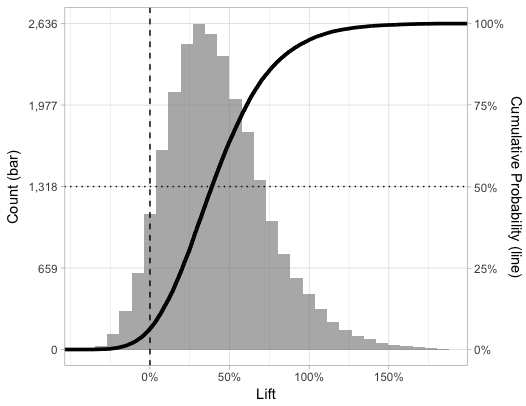

### Bayesian A/B Testing

Code repository that visualizes A/B Test results using a simulated beta distribution and ecdf on the same chart via ggplot2 in R.

Useful to measure click-through rate A/B tests to visualize distribution of possible lift, as well as the probability that the test CTR > control CTR

Additional Info: <a href="https://www.countbayesie.com/blog/2015/4/25/bayesian-ab-testing" target="_blank">Count Bayesie Bayesian AB Testing</a>  

### Example Plot Output & Interpretation

Control CTR = 25%,

Control Trials = 100

Test CTR = 35%,

Test Trials = 100

The histogram shows the distribution of simulated Test CTR's / Control CTR's to visualize potential Test lift.

The line shows the cumulative distribution. This can be used to quantify the probability of a certain lift. For example, in the above plot, there is a 50% chance that the test group will exhibit a lift of 40% or more (the median effect, same as (.35 - .25) / .25).

The line intercept at x = 0% shows the probability that the test group will underperform the control group, or ~ 6.5%. 1 - .065 = 93.5%, or the probability that the test group will overperform the control group. 

A p-value can be derived from the line intercept at 0, or ~.065 above. This is interpreted as the probability that this result would occur by chance alone, given that the control CTR is true. 

Classically, a statistically significant result (typically, p < .05) tells us that 2 values are not likely the same (i.e. not from the same distribution). However, we may want to know how much better the test group will perform. The plotted distribution gives a probabilistic view of that lift.

### Shiny App

https://bigtimestats.shinyapps.io/Bayesian-AB-Testing-App/

The shiny app takes all of the above, allows a user to input custom A/B test results, adds the Bayesian Probability that Test > Control, and computes the p-value using a single tailed t-test (Classical Hypothesis Test).

1 - the Bayesian Probability is within range of the classically computed p-value, which is expected. 

Some benefits of the app:
1. Visualize possible outcomes probabilistically.
2. Not have to determine sample size ahead of time, nor wait for a test to be "statistically significant"
3. Allow inputs of prior knowledge of the control/test distribution, which will adjust evidence needed to overturn control (not applicable to p-value calculation by design)

One limitation of the R ggplotly package (interactive plot) is that it does not have the capability to visualize a secondary axis. A user can hover over the line values to see the Cumulative Probability.

### License

 This work is licensed under a <a rel="license" href="http://creativecommons.org/licenses/by/4.0/">Creative Commons Attribution 4.0 International License</a>.

Commercial use ok, derivative work ok, attribution required.

